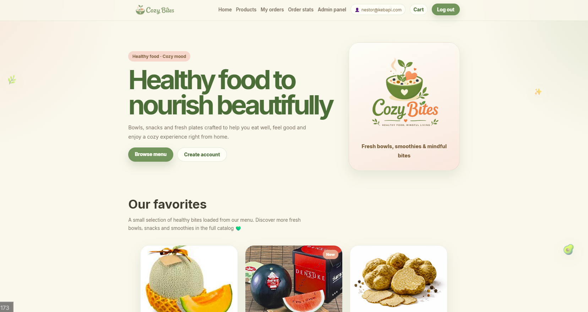
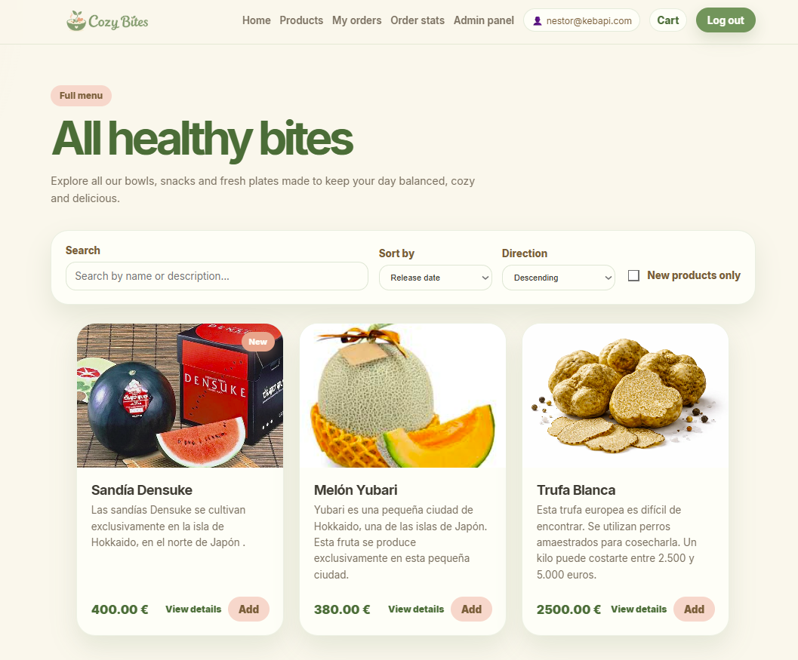
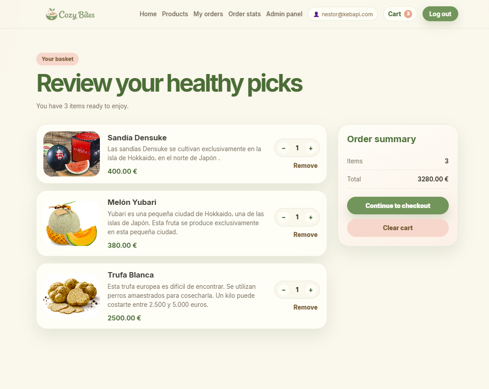
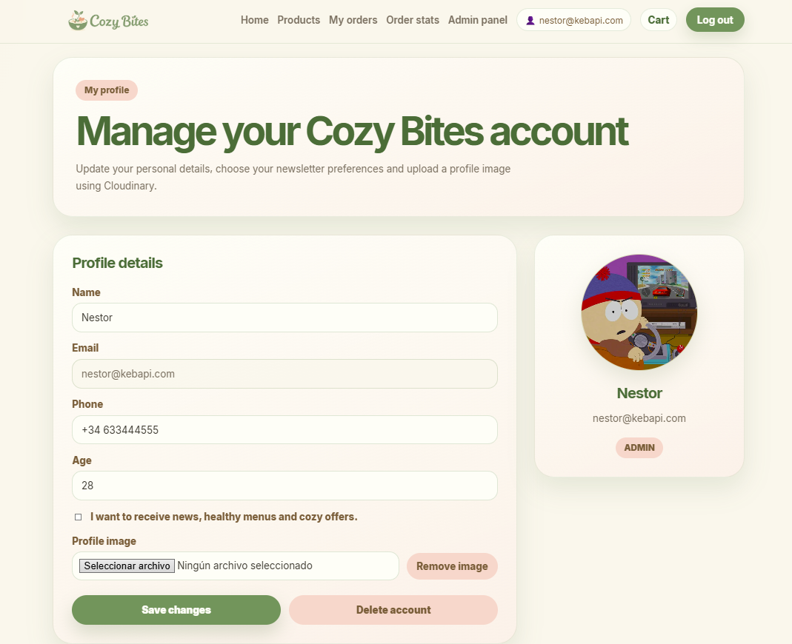
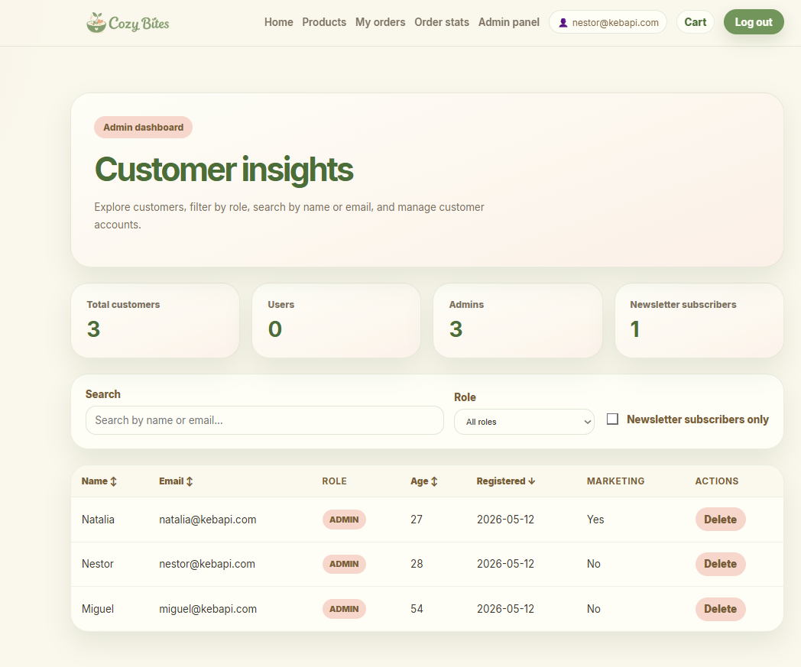

# Cozy Bites · Healthy Food Store

<p align="center">
  
</p>

>                                 🌱 Healthy food, cozy mood 🌱  

 Aplicación web para una tienda de comida saludable con catálogo de productos, autenticación, carrito, checkout, pedidos, panel de administración, dashboards y perfil de usuario con subida de imagen a Cloudinary.


## Índice

- [Descripción](#descripción)
- [Capturas / logos](#capturas--logos)
- [Tecnologías utilizadas](#tecnologías-utilizadas)
- [Librerías principales](#librerías-principales)
- [Funcionalidades](#funcionalidades)
- [Roles de usuario](#roles-de-usuario)
- [Estructura del proyecto](#estructura-del-proyecto)
- [Variables de entorno](#variables-de-entorno)
- [Instalación y ejecución](#instalación-y-ejecución)
- [Integración con la API](#integración-con-la-api)
- [Integración con Cloudinary](#integración-con-cloudinary)
- [Dashboards y visualización de datos](#dashboards-y-visualización-de-datos)
- [Diseño y experiencia visual](#diseño-y-experiencia-visual)
- [Sostenibilidad y accesibilidad](#sostenibilidad-y-accesibilidad)
- [Scripts disponibles](#scripts-disponibles)
- [Autores](#autores)


## Descripción

**Cozy Bites** es una aplicación frontend desarrollada con React y TypeScript para consumir una API REST de una tienda de comida saludable →
[API de Cozy Bites](https://github.com/Mig1881/Backend_Practicas_Mayo.git)

La aplicación permite a los usuarios consultar productos, registrarse, iniciar sesión, añadir productos al carrito, realizar un checkout y consultar sus pedidos. Además, los usuarios pueden gestionar su perfil y subir una imagen de perfil mediante Cloudinary.

Los administradores tienen acceso a un panel privado desde el que pueden consultar dashboards, gestionar clientes y administrar productos.


## Capturas / logos


### Logo principal

<p align="center">
  
</p>

### Logo alternativo

<p align="center">
  
</p>

### Captura de Home



### Captura de catálogo



### Captura de carrito



### Captura de perfil



### Captura de panel admin




## Tecnologías utilizadas

- **React**
- **TypeScript**
- **Vite**
- **React Router**
- **CSS propio**
- **Motion**
- **Cloudinary**
- **API REST con JWT**
- **LocalStorage**


## Librerías principales

### React Router

Usado para gestionar la navegación entre páginas:

- `/`
- `/products`
- `/products/:id`
- `/login`
- `/register`
- `/cart`
- `/checkout`
- `/orders`
- `/dashboard`
- `/profile`
- `/admin`
- `/admin/dashboard`
- `/admin/items`
- `/admin/items/new`
- `/admin/items/:id/edit`

### Motion

Se ha utilizado la librería `motion` para añadir animaciones suaves en componentes visuales, especialmente en tarjetas de producto y vistas de detalle.

Ejemplo de uso:

```tsx
import { motion } from "motion/react";
````

Se utiliza para mejorar la experiencia visual con animaciones como:

* aparición suave de tarjetas
* desplazamiento vertical
* efectos hover
* transiciones discretas

### Cloudinary

Se utiliza como servicio externo para subir imágenes de perfil de usuario.

La imagen se sube desde el frontend a Cloudinary y la URL resultante se guarda posteriormente en la API.


## Funcionalidades

### Catálogo de productos

* Visualización de productos reales obtenidos desde la API.
* Vista de catálogo general.
* Vista de detalle de producto.
* Carga dinámica de imágenes desde el backend.
* Filtros y ordenación:

  * búsqueda por nombre o descripción
  * filtro de productos nuevos
  * ordenación por fecha
  * ordenación por nombre
  * ordenación por precio
  * orden ascendente o descendente


### Autenticación

* Registro de usuario.
* Inicio de sesión.
* Gestión de token JWT.
* Persistencia de sesión en `localStorage`.
* Control de roles.
* Redirección a login cuando el usuario intenta añadir productos al carrito sin estar autenticado.


### Carrito

* Carrito local gestionado en frontend.
* Persistencia en `localStorage`.
* Añadir productos desde cards y detalle.
* Aumentar y disminuir cantidades.
* Eliminar productos del carrito.
* Vaciar carrito.
* Cálculo de total de productos y precio total.
* Acceso protegido solo para usuarios autenticados.


### Checkout

* Vista de checkout protegida.
* Formulario de datos de entrega.
* Resumen del pedido.
* Creación de pedidos reales mediante `POST /orders`.
* Vaciado del carrito tras completar el pedido.
* Mensaje de confirmación.


### Pedidos

* Página `My orders`.
* Consulta de pedidos reales desde la API.
* Filtrado de pedidos por usuario autenticado.
* Estado de carga.
* Estado de error.
* Estado vacío.
* Visualización de fecha y total de cada pedido.


### Estadísticas de pedidos

Página `Order stats`.

Incluye:

* total de pedidos
* gasto total
* pedido medio
* última fecha de pedido
* búsqueda por producto
* filtro por fecha
* tabla con ordenación
* estados de carga, error y ausencia de datos


### Perfil de usuario

Página protegida `/profile`.

Permite:

* consultar datos del usuario autenticado
* editar nombre
* editar teléfono
* editar edad
* modificar suscripción a newsletter
* subir imagen de perfil a Cloudinary
* eliminar imagen de perfil
* eliminar la cuenta del usuario

Esta funcionalidad completa el CRUD de usuarios:

* **Create** → registro
* **Read** → perfil
* **Update** → edición de perfil
* **Delete** → eliminación de cuenta


### Panel de administración

El administrador accede desde:

```text
/admin
```

Desde ahí puede elegir entre:

```text
Customer dashboard
Product dashboard
```


### Customer dashboard

Página para administración de clientes.

Incluye:

* total de clientes
* total de usuarios
* total de administradores
* suscriptores a newsletter
* búsqueda por nombre o email
* filtro por rol
* filtro por suscripción a newsletter
* tabla con ordenación
* eliminación de clientes


### Product dashboard

Página para administración de productos.

Incluye:

* total de productos
* productos nuevos
* precio medio
* última fecha de lanzamiento
* búsqueda por nombre o descripción
* filtro de productos nuevos
* ordenación por fecha, nombre o precio
* creación de productos
* edición de productos
* eliminación de productos
* carga de imágenes en productos


## Roles de usuario

### Usuario no autenticado

Puede:

* ver Home
* ver catálogo de productos
* ver detalle de producto
* registrarse
* iniciar sesión

No puede:

* añadir productos al carrito
* acceder al carrito
* hacer checkout
* ver pedidos
* acceder al perfil
* acceder a dashboards privados


### Usuario autenticado

Puede:

* añadir productos al carrito
* acceder al carrito
* hacer checkout
* ver sus pedidos
* consultar estadísticas de pedidos
* editar su perfil
* subir imagen de perfil
* eliminar su cuenta


### Administrador

Puede hacer todo lo anterior y además:

* acceder al panel de administración
* ver dashboard de clientes
* eliminar clientes
* ver dashboard de productos
* crear productos
* editar productos
* eliminar productos


## Estructura del proyecto

```text
src/
├── api/
│   └── apiFetch.ts
│
├── components/
│   ├── admin/
│   │   └── ProductForm.tsx
│   ├── Footer.tsx
│   ├── Navbar.tsx
│   ├── ProductCard.tsx
│   └── ProtectedRoute.tsx
│
├── context/
│   ├── AuthContext.tsx
│   └── CartContext.tsx
│
├── pages/
│   ├── admin/
│   │   ├── AdminDashboardPage.tsx
│   │   ├── AdminHomePage.tsx
│   │   ├── AdminItemsPage.tsx
│   │   ├── CreateProductPage.tsx
│   │   └── EditProductPage.tsx
│   ├── CartPage.tsx
│   ├── CheckoutPage.tsx
│   ├── HomePage.tsx
│   ├── LoginPage.tsx
│   ├── OrdersPage.tsx
│   ├── ProductDetailPage.tsx
│   ├── ProductsPage.tsx
│   ├── ProfilePage.tsx
│   ├── RegisterPage.tsx
│   └── UserDashboardPage.tsx
│
├── services/
│   ├── authService.ts
│   ├── cloudinaryService.ts
│   ├── customerService.ts
│   ├── itemService.ts
│   └── orderService.ts
│
├── types/
│   ├── auth.types.ts
│   ├── cart.types.ts
│   ├── customer.types.ts
│   ├── item.types.ts
│   └── order.types.ts
│
├── utils/
│   └── fileToBase64.ts
│
├── App.tsx
├── index.css
└── main.tsx
```


## Variables de entorno

Crear un archivo `.env` en la raíz del proyecto:

```env
VITE_API_URL=http://localhost:8080
VITE_CLOUDINARY_CLOUD_NAME=tu_cloud_name
VITE_CLOUDINARY_UPLOAD_PRESET=tu_upload_preset
```

Crear también `.env.example`:

```env
VITE_API_URL=http://localhost:8080
VITE_CLOUDINARY_CLOUD_NAME=
VITE_CLOUDINARY_UPLOAD_PRESET=
```

No subir `.env` con valores reales si contiene datos privados.


## Instalación y ejecución

### 1. Clonar el repositorio

```bash
git clone URL_DEL_REPOSITORIO
cd cozy-bites-frontend
```

### 2. Instalar dependencias

```bash
npm install
```

### 3. Crear archivo `.env`

```env
VITE_API_URL=http://localhost:8080
VITE_CLOUDINARY_CLOUD_NAME=tu_cloud_name
VITE_CLOUDINARY_UPLOAD_PRESET=tu_upload_preset
```

### 4. Ejecutar en desarrollo

```bash
npm run dev
```

La aplicación se levantará normalmente en:

```text
http://localhost:5173
```

o:

```text
http://localhost:5174
```

dependiendo del puerto disponible de Vite.


## Integración con la API

La comunicación con backend se centraliza mediante `apiFetch`.

Este helper:

* usa automáticamente `VITE_API_URL`
* añade `Content-Type: application/json`
* añade el token JWT en `Authorization` si existe
* gestiona respuestas JSON y texto

Ejemplo de uso:

```ts
return apiFetch<Item[]>("/items");
```


## Integración con Cloudinary

La subida de imagen de perfil se realiza mediante `cloudinaryService`.

Flujo:

```text
Usuario selecciona imagen
→ frontend envía imagen a Cloudinary
→ Cloudinary devuelve secure_url
→ frontend guarda esa URL en profileImageUrl
→ API persiste la URL en el perfil del usuario
```

Servicio utilizado:

```ts
export async function uploadImageToCloudinary(file: File): Promise<string>
```

Variables necesarias:

```env
VITE_CLOUDINARY_CLOUD_NAME=
VITE_CLOUDINARY_UPLOAD_PRESET=
```


## Dashboards y visualización de datos

La aplicación incluye dashboards dinámicos con:

* tarjetas de resumen
* tablas de datos
* búsqueda reactiva
* filtros
* ordenación
* estados de carga
* estados de error
* estados de ausencia de datos

### Dashboard de usuario

Ruta:

```text
/dashboard
```

Muestra estadísticas de pedidos del usuario autenticado.

### Dashboard de clientes

Ruta:

```text
/admin/dashboard
```

Muestra información de clientes para administradores.

### Dashboard de productos

Ruta:

```text
/admin/items
```

Muestra información y gestión de productos para administradores.


## Diseño y experiencia visual

La estética de Cozy Bites se ha construido con CSS propio.

Elementos visuales utilizados:

* paleta suave y cálida
* tonos crema, verde salvia, blush y cocoa
* tarjetas redondeadas
* sombras suaves
* gradientes sutiles
* badges tipo pill
* animaciones con Motion
* emojis flotantes decorativos
* diseño responsive

No se ha utilizado Tailwind, Bootstrap ni librerías de componentes visuales.

La identidad visual se apoya en:

```text
Healthy food · Cozy mood
```

## Sostenibilidad y accesibilidad

Se han aplicado mejoras sencillas para reducir carga visual, mejorar la accesibilidad y optimizar el consumo de recursos:

- Se ha añadido soporte para `prefers-reduced-motion`, reduciendo animaciones cuando el usuario lo solicita desde la configuración de su sistema operativo o navegador.  
  Esto permite que personas con sensibilidad al movimiento, mareos o preferencia por interfaces más estáticas puedan navegar con una experiencia más cómoda. Por ejemplo, si el usuario activa la opción **Reducir movimiento** en su dispositivo, la web disminuye automáticamente animaciones, transiciones y efectos decorativos.

- Se ha añadido carga diferida (`loading="lazy"`) y decodificación asíncrona (`decoding="async"`) en imágenes de producto y vistas no críticas.  
  De esta forma, las imágenes que no son necesarias de inmediato no se cargan al instante, reduciendo el trabajo inicial del navegador y mejorando el rendimiento.

- Se ha mejorado la navegación por teclado mediante estilos globales de `:focus-visible`.  
  Esto permite identificar visualmente qué elemento está seleccionado al navegar usando teclado.

- Se han añadido atributos `aria-label` en botones de acción que pueden necesitar más contexto, como botones de eliminar, aumentar cantidad o reducir cantidad.

- Se han añadido roles y `aria-live` en mensajes de error y éxito para mejorar la compatibilidad con lectores de pantalla.

- Se mantiene una interfaz ligera basada en CSS propio, sin librerías visuales pesadas, lo que reduce dependencias y evita cargar recursos innecesarios.

## Scripts disponibles

```bash
npm run dev
```

Ejecuta la aplicación en modo desarrollo.

```bash
npm run build
```

Genera la versión de producción.

```bash
npm run preview
```

Previsualiza la build de producción.

```bash
npm run lint
```

Ejecuta el linter del proyecto.


## Autores

Miguel Ángel Rubio, Néstor Allepuz y Natalia Garré

· Prácticas Mayo 2026 ·


